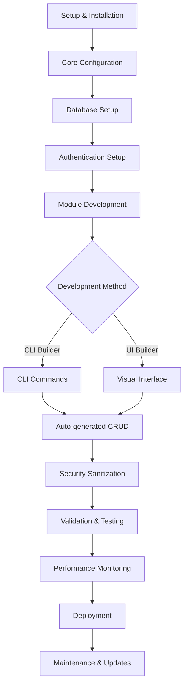

# Modul dan Fitur Platform CMS

## Modul Utama yang Diperlukan

### Core Modules

#### 1. Authentication & Authorization
- JWT-based authentication
- Multi-factor authentication support
- Session management
- Password policies
- Account lockout protection

#### 2. User Management
- User registration dan verification
- Profile management
- User preferences
- Account lifecycle management

#### 3. Role & Permission Management
- Hierarchical role system
- Granular permissions
- Dynamic role assignment
- Permission inheritance
- Audit trail untuk perubahan akses

#### 4. Database Management (Multi-driver)
- PostgreSQL (primary)
- MySQL support
- SQLite untuk development
- Database migration system
- Connection pooling
- Query optimization

#### 5. Security & Sanitization
- Input validation dan sanitization
- Output encoding
- XSS prevention
- SQL injection protection
- CSRF protection
- Rate limiting per endpoint

#### 6. Error Handling & Logging
- Structured logging
- Error categorization
- Detailed error messages
- Performance monitoring
- Security event logging
- Log rotation dan archiving

#### 7. Performance Monitoring
- Response time tracking
- Database query analysis
- Memory usage monitoring
- CPU utilization tracking
- Real-time alerts
- Performance dashboards

#### 8. API Rate Limiting
- Per-user rate limiting
- Per-endpoint rate limiting
- Burst protection
- Whitelist/blacklist support
- Analytics untuk API usage

#### 9. File Upload & Management
- Secure file upload
- File type validation
- Virus scanning integration
- Image resizing dan optimization
- Cloud storage support (S3, etc.)
- CDN integration

#### 10. Configuration Management
- Environment-based configuration
- Feature flags
- Dynamic configuration reload
- Configuration validation
- Secrets management

### Builder Modules

#### 1. CLI Builder (untuk AI/programmer)
- CRUD generator commands
- Model generation
- Controller generation
- Migration generator
- Test generator
- Documentation generator
- Validation rules generator

#### 2. UI Builder (visual interface)
- Drag-and-drop interface builder
- Form builder
- Table builder
- Chart dan dashboard builder
- Component library
- Theme customization

#### 3. CRUD Generator
- Automated model-based CRUD
- Custom field types
- Relationship handling
- Validation rules
- Permission integration
- API endpoint generation

#### 4. Module Template Engine
- Reusable module templates
- Template customization
- Template versioning
- Template marketplace
- Custom template creation

#### 5. Code Documentation Generator
- API documentation (OpenAPI)
- Code comments generation
- README generation
- Changelog automation
- Architecture diagrams

### Infrastructure Modules

#### 1. Database Migration System
- Version-controlled migrations
- Rollback support
- Seed data management
- Schema comparison
- Migration validation

#### 2. Caching Layer
- Redis integration
- In-memory caching
- Query result caching
- Page caching
- Cache invalidation strategies

#### 3. Queue Management
- Job scheduling
- Background processing
- Queue monitoring
- Failed job handling
- Priority queues

#### 4. Notification System
- Email notifications
- SMS notifications
- In-app notifications
- Push notifications
- Notification templates
- Delivery tracking

#### 5. Backup & Recovery
- Automated database backups
- File system backups
- Point-in-time recovery
- Backup verification
- Disaster recovery procedures

## Alur Besar Sistem

## Data Utama yang Perlu Disimpan

### System Data
- **Users**: id, email, password_hash, roles, preferences, created_at, updated_at
- **Roles**: id, name, description, permissions, hierarchy_level
- **Permissions**: id, name, resource, action, scope
- **Sessions**: id, user_id, token, expires_at, ip_address, user_agent
- **Modules**: id, name, version, status, configuration, dependencies
- **Templates**: id, type, name, schema, validation_rules
- **Configurations**: key, value, type, environment, encrypted

### Operational Data
- **Logs**: level, message, context, timestamp, request_id, user_id
- **Metrics**: name, value, unit, timestamp, labels
- **Performance**: endpoint, response_time, status_code, timestamp
- **Files**: id, filename, path, size, mime_type, checksum, user_id
- **Uploads**: id, original_name, stored_name, size, status, metadata

### Metadata
- **Module Schemas**: field definitions, relationships, constraints
- **API Contracts**: endpoints, parameters, responses, validation
- **Validation Rules**: field rules, custom validators, error messages
- **Security Policies**: access rules, rate limits, security headers
- **Documentation**: auto-generated docs, manual docs, examples

---
*Dokumen ini akan diperbarui seiring dengan perkembangan modul-modul baru*