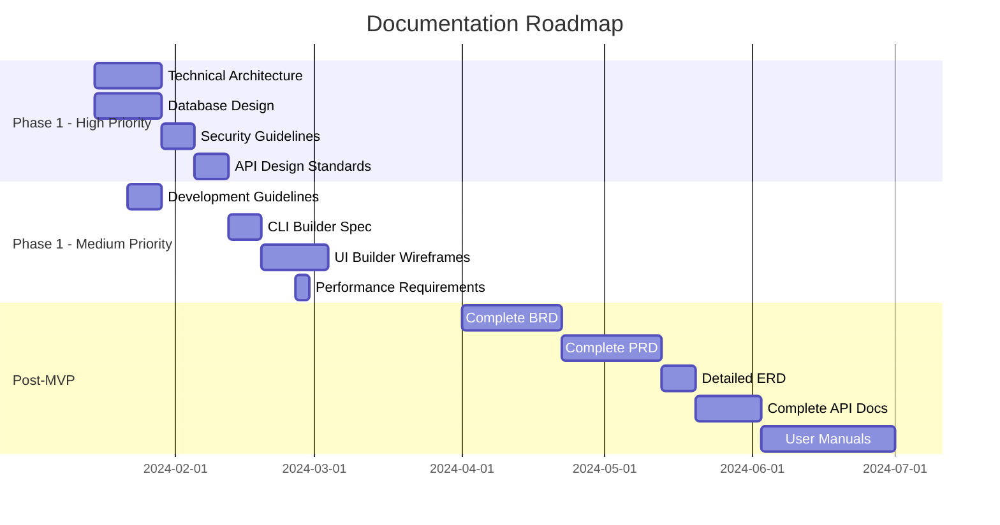

# Roadmap Dokumentasi Selanjutnya

## Dokumen Prioritas Tinggi (Setelah Klarifikasi)

### 1. Technical Architecture Document
**Timeline**: Setelah klarifikasi infrastruktur  
**Estimasi**: 1-2 minggu  
**Dependencies**: Keputusan deployment strategy, skala requirements

**Content akan mencakup:**
- System architecture overview
- Component interaction diagrams
- Database architecture
- API gateway design
- Security architecture
- Deployment architecture
- Performance optimization strategy
- Monitoring dan observability design

**Deliverables:**
- Architecture diagrams (C4 model)
- Component specifications
- Integration patterns
- Non-functional requirements specification

### 2. Database Design Document
**Timeline**: Parallel dengan Technical Architecture  
**Estimasi**: 1-2 minggu  
**Dependencies**: Multi-tenancy decisions, data volume estimates

**Content akan mencakup:**
- Database schema design
- Entity relationship diagrams
- Index strategy
- Migration strategy
- Data retention policies
- Backup dan recovery procedures
- Performance optimization
- Multi-database compatibility layer

**Deliverables:**
- Complete ERD
- Table specifications
- Migration scripts
- Performance benchmarks

### 3. Security Guidelines
**Timeline**: Early dalam Phase 1  
**Estimasi**: 1 minggu  
**Dependencies**: Compliance requirements, security level decisions

**Content akan mencakup:**
- Security architecture
- Authentication dan authorization patterns
- Input validation standards
- Output sanitization procedures
- Security testing procedures
- Incident response procedures
- Security audit checklist
- Compliance mapping

**Deliverables:**
- Security implementation guide
- Security checklist
- Threat model
- Security testing procedures

### 4. API Design Standards
**Timeline**: Before API development  
**Estimasi**: 0.5-1 minggu  
**Dependencies**: Integration requirements

**Content akan mencakup:**
- REST API conventions
- Response format standards
- Error handling patterns
- Versioning strategy
- Rate limiting policies
- Authentication patterns
- Documentation standards (OpenAPI)
- Testing patterns

**Deliverables:**
- API design guide
- Response format templates
- OpenAPI specification templates
- API testing standards

## Dokumen Prioritas Medium (Selama Phase 1)

### 5. Development Guidelines
**Timeline**: Early Phase 1  
**Estimasi**: 1 minggu

**Content:**
- Coding standards dan conventions
- Git workflow dan branching strategy
- Code review procedures
- Testing requirements dan patterns
- Documentation requirements
- CI/CD pipeline configuration
- Quality gates dan metrics
- Development environment setup

### 6. CLI Builder Specification
**Timeline**: Before CLI development  
**Estimasi**: 1 minggu

**Content:**
- CLI architecture design
- Command structure dan syntax
- Template system design
- Generator algorithms
- AI integration patterns
- Extension mechanisms
- Configuration management
- Usage examples dan tutorials

### 7. UI Builder Wireframes
**Timeline**: Before UI Builder development  
**Estimasi**: 2 minggu

**Content:**
- User interface mockups
- User experience flows
- Component library specifications
- Interaction patterns
- Responsive design guidelines
- Accessibility requirements
- Theme dan customization system
- User testing procedures

### 8. Performance Requirements
**Timeline**: Early Phase 1  
**Estimasi**: 0.5 mingka

**Content:**
- Performance benchmarks dan SLAs
- Load testing procedures
- Performance monitoring setup
- Optimization strategies
- Bottleneck identification procedures
- Scaling strategies
- Resource usage guidelines
- Performance testing automation

## Dokumen Prioritas Rendah (Setelah MVP)

### 9. Business Requirements Document (BRD)
**Timeline**: Post-MVP  
**Estimasi**: 2-3 minggu

**Content:**
- Complete business requirements
- Stakeholder analysis
- Business process mapping
- ROI analysis
- Market analysis
- Competitive analysis
- Business rules specification
- Success metrics definition

### 10. Product Requirements Document (PRD)
**Timeline**: Post-MVP  
**Estimasi**: 2-3 minggu

**Content:**
- Feature specifications
- User stories dan acceptance criteria
- Priority matrix
- Release planning
- User persona definitions
- Journey mapping
- Feature analytics requirements
- Feedback collection procedures

### 11. Complete ERD (Detailed)
**Timeline**: After database stabilization  
**Estimasi**: 1 minggu

**Content:**
- Detailed entity definitions
- Complete relationship mapping
- Constraint specifications
- Index optimization
- Partitioning strategy
- Archive procedures
- Data lineage documentation
- Performance analysis

### 12. Complete API Contract Documentation
**Timeline**: After API stabilization  
**Estimasi**: 1-2 minggu

**Content:**
- Complete OpenAPI specifications
- SDK documentation
- Integration examples
- Error code catalog
- Rate limiting documentation
- Webhook specifications
- Authentication examples
- Client library documentation

### 13. User Manual & Training Materials
**Timeline**: Pre-launch  
**Estimasi**: 3-4 minggu

**Content:**
- End-user documentation
- Administrator guides
- Developer tutorials
- Video training materials
- FAQ dan troubleshooting
- Best practices guide
- Migration guides
- Support procedures

## Timeline Overview

## Dependencies dan Kriteria

### Pre-requisites untuk High Priority Documents
- [ ] Stakeholder feedback pada current analysis
- [ ] Infrastructure decisions (cloud vs on-premise)
- [ ] Scale requirements clarification
- [ ] Compliance requirements definition
- [ ] Budget constraints confirmation

### Quality Gates
- [ ] Technical review oleh senior architect
- [ ] Security review untuk security-related docs
- [ ] Usability review untuk user-facing docs
- [ ] Accuracy verification dengan actual implementation
- [ ] Version control dan change management

### Update Triggers
- Architecture changes
- New requirements
- Technology stack changes
- Performance requirement changes
- Security requirement updates

## Maintenance Strategy

### Document Lifecycle
1. **Creation**: Initial authoring dengan review
2. **Validation**: Implementation validation
3. **Maintenance**: Regular updates
4. **Archival**: Version management

### Update Frequency
- **Architecture docs**: Major changes only
- **API docs**: Every API change
- **User docs**: Every release
- **Security docs**: Quarterly review

### Ownership Assignment
- **Technical docs**: Lead Developer / Architect
- **Business docs**: Product Manager
- **User docs**: Technical Writer / Product Manager
- **Security docs**: Security Lead / DevOps

---
*Roadmap ini akan disesuaikan berdasarkan feedback dan development progress*